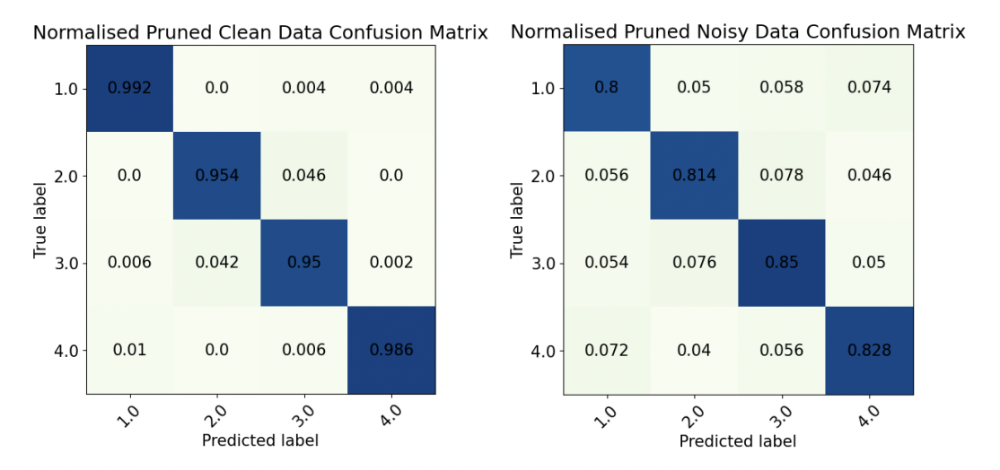

# Intro to Machine Learning Coursework 1: Decision Trees

## Overview

This repository contains the implementation and analysis of a decision tree algorithm designed to determine the room in which measurements were taken based on seven WiFi signal strengths. The project was conducted as part of the Intro to Machine Learning course at Imperial College London.

## Authors

- Aidan Holmes
- Meg Howard
- Hugo Frelin
- Igor Sadalski

## Date

November 3, 2023

## Project Structure

- **Decision Tree Implementation**: The core algorithm used to classify room data based on WiFi signal strengths.
- **Data**: Includes both clean and noisy datasets used for training and evaluation.
- **Visualisation**: Functions to visualise the decision tree structure.
- **Evaluation**: Scripts to compute performance metrics such as accuracy, recall, precision, and F1 measure.

## Key Findings

### Performance Metrics
- **Evaluation**: Metrics were calculated using 10-fold cross-validation on both clean and noisy datasets.
  - **Clean Data**: Demonstrated high accuracy and F1 measures across all rooms.
  - **Noisy Data**: Performance was lower, with Room 3 showing the highest accuracy but the lowest F1-score due to false positives.

### Pruned Decision Tree
- **Effects of Pruning**: Pruning was applied to address overfitting, particularly in noisy datasets.
  - **Clean Data**: Minimal change in performance metrics, indicating that the tree already captured effective patterns.
  - **Noisy Data**: Improved performance by reducing overfitted branches.

- **Performance Metrics Comparison**:
  - **Unpruned Tree Metrics**:
    
  - **Pruned Tree Metrics**:
    

### Depth Analysis
- **Insights**: Pruning significantly reduced the average depth of the decision tree, particularly for noisy data, enhancing generalization without compromising accuracy.

## Visualisations
- **Tree Representations**: Below are visualizations of the decision tree before and after pruning, highlighting the reduction in complexity:
  - **Before Pruning**:
    
  - **After Pruning**:
    

## Conclusion

The decision tree algorithm effectively classifies room data, with pruning enhancing performance in noisy datasets by reducing overfitting. The clean dataset consistently outperforms the noisy dataset across all metrics.

## Usage

To run the decision tree algorithm and visualise results, follow the instructions in the `scripts` directory. Ensure all dependencies are installed as listed in `requirements.txt`.

## License

This project is licensed under the MIT License. See the `LICENSE` file for details.
